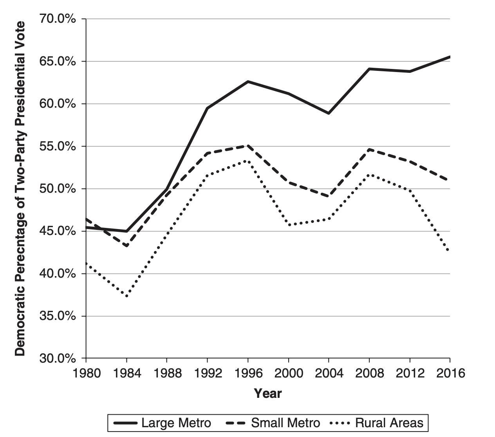
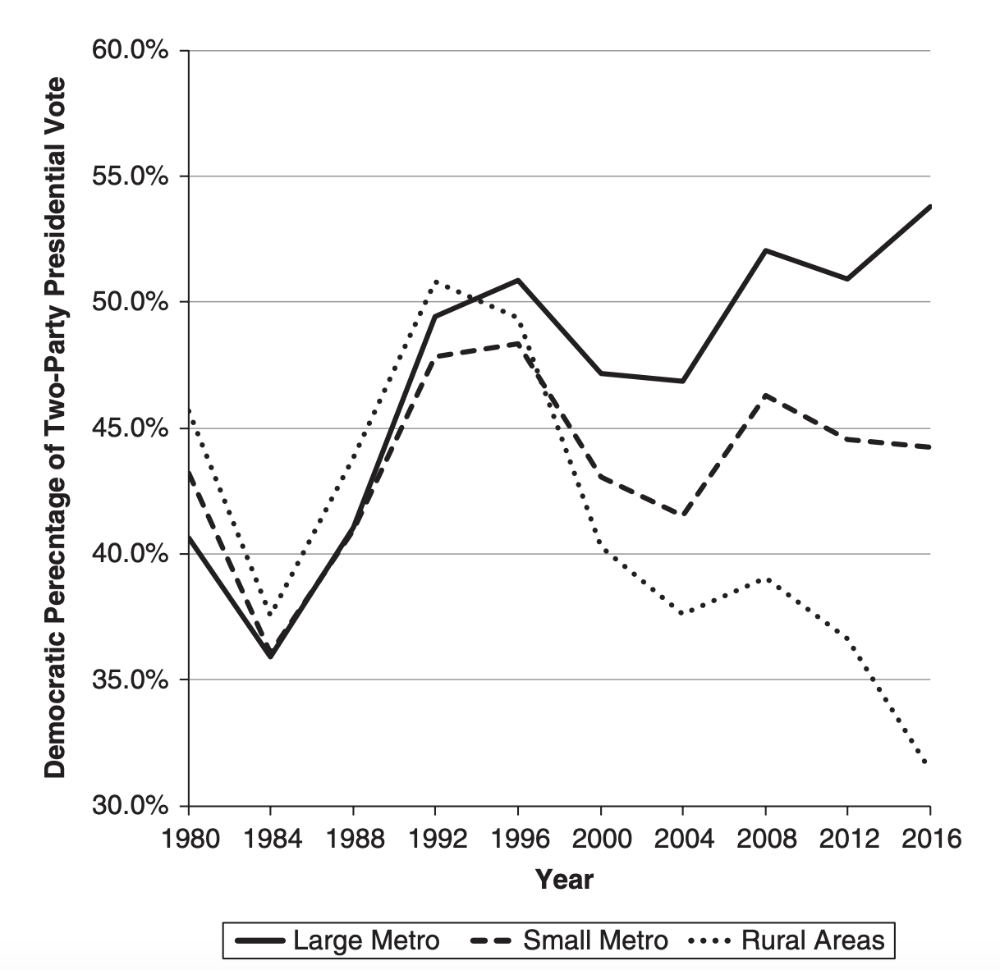

```{r setup, include=FALSE}
knitr::opts_chunk$set(echo = TRUE)
library(tidyverse)
library(ggplot2)
library(usmap)
library(janitor)
library(usmap)
library(data.table)
library(geofacet) ## map-shaped grid of ggplots
library(statebins)

demo_df <- read_csv("../Data/demographic_data_209.csv") 
old_voting_df <- read_csv("../Data/countypres_2000-2016.csv") %>% filter(year == 2016)

voting_df <- read_csv("../Data/county_results_2020.csv") %>% row_to_names(row_number = 1) 

old_voting_wide <- old_voting_df %>% filter(party == "democrat") %>%
  left_join(old_voting_df %>% filter(party == "republican"), 
            by = c("state" =  "state", "FIPS" = "FIPS", "county" = "county")) %>% 
  select(state, FIPS, candidatevotes.x, candidatevotes.y, totalvotes.x) %>%
  mutate(dem_percent = candidatevotes.x / (candidatevotes.x + candidatevotes.y), 
         rep_percent = candidatevotes.y/(candidatevotes.x + candidatevotes.y))
colnames(old_voting_wide) <- c("state", "fips", "dem_votes", "rep_votes", 
                               "total_votes", "dem_percent", "rep_percent")
old_voting_wide$fips <- as.character(old_voting_wide$fips)

voting_df$totalvote <- as.numeric(as.character(voting_df$totalvote))
voting_df$vote1 <- as.numeric(as.character(voting_df$vote1))
voting_df$vote2 <- as.numeric(as.character(voting_df$vote2))

voting_df <- voting_df %>% select(fips, totalvote, vote1, vote2) %>% 
  mutate(dem_percent = vote1/(vote1+vote2), rep_percent = vote2/(vote1+vote2))

demo_df$fips <- as.character(demo_df$fips)
demo_df <- demo_df %>% select(fips, median_age, female_percentage, 
                              population, life_expectancy, pct_none, pct_hs, pct_bachelors, 
                              pct_black, pct_asian, pct_hispanic, pct_non_hispanic_white, 
                              median_household_income, pct_rural, pop_density)

full_df <- voting_df %>% left_join(old_voting_wide, by = c("fips" = "fips")) %>%
  select(fips, dem_percent.x, rep_percent.x, dem_percent.y, rep_percent.y, state)
colnames(full_df) <- c("fips", "dem_2020_share", "rep_2020_share", "dem_2016_share", "rep_2016_share", "state")
full_df <- full_df %>% left_join(demo_df, by = c("fips" = "fips"))

full_df <- full_df %>% mutate(dem_change = 100*(dem_2020_share - dem_2016_share), 
                              rep_change = 100*(rep_2020_share - rep_2016_share))

```

## Introduction
In any election, and especially 2020, we need to work to not only understand what happened in the Presidential election but also *why* it happened. Throughout this class, I have mostly been focused on prediction, rather than inference. In this post, I will assess an important theme of the 2020: the urban-rural divide between Republicans and Democrats, and start the process of establishing a causal relationship. 

## The Urban Rural Divide
Between the two major parties, there has been growing evidence of the urban rural divide since the 1980s. Cities, and generally more urban areas tend to vote for Democrat candidates, while rural areas vote for Republicans. The phenomenon is well documented. Earlier in this semester, we read chapters from *Red Fighting Blue: How Geography and Electoral Rules Polarize American Politics* by David Hopkins, which demonstrates the growing divide. 

<center>

{width=50%}

</center>


We can also see some differentiation between the coasts, meaning the Pacific Northwest and Northeast and the rest of the country. There is a much sharper divergence between urban and rural areas in the Midwest and south after the 1996 election, following Bill Clinton's presidency.

<center>

{width=50%}

</center>

In the aftermath of the election, there has been a lot written about the urban-rural divide. Even back before the election, FiveThirtyEight published [this piece](https://fivethirtyeight.com/features/how-urban-or-rural-is-your-state-and-what-does-that-mean-for-the-2020-election/) that shows the connections between how urban or rural a state is and which way they voted in 2016. The correlation is striking. NPR just published [an article](https://www.npr.org/2020/11/18/934631994/bidens-win-shows-rural-urban-divide-has-grown-since-2016) full of quotes from farmers and people from rural areas worried about how the incoming Biden administration will handle the rural economy, which is in disarray due to the COVID-19 pandemic. In addition, if you look at [maps of where COVID-19 is hitting the country hardest](https://www.nytimes.com/interactive/2020/us/coronavirus-us-cases.html) at the moment, it primarily is impact rural states. Even in the language of his [victory speech](https://www.nytimes.com/article/biden-speech-transcript.html), Biden was already reaching out to rural communities that did not vote for him, to begin what he referred to as a healing process. 

## Why It Matters
Understanding the urban-rural divide gives insight into a host of factors about people's lives, and also shows the balance of power in American politics today. As previously mentioned, there do seem to be real differences between urban and rural areas that manifest themselves in how they vote. These differences include but are not limited to the economy, religion, views on race, education, and many other facets. Understanding how these factors interact are key to understanding elections, and we can use elections to understand which of these factors is most important. 

The urban-rural divide also controls the balance of power in American politics. Because of institutions like the Senate and the Electoral College, certain areas have a disproportionate amount of voting power compared to their population. With the current electoral divide between urban and rural areas, this gives the Republican party a huge amount of power. According to calculations by FiveThirtyEight's Nate Silver, the Senate leans roughly [6.6 percentage points more Republican](https://fivethirtyeight.com/features/the-senates-rural-skew-makes-it-very-hard-for-democrats-to-win-the-supreme-court/) as a whole. When it comes to governing strategy, this gives Republicans the options to rule as relative extremists[^1] and still have a high chance of keeping control of the chamber. 

The Electoral College's bias is more complicated to unpack. It has the same state level bias towards rural states, but the winner take all nature gives an incredible amount of power to cities. For example, in Georgia, swings in the areas around [Atlanta flipped the entire state for Biden](https://www.politico.com/news/2020/11/13/georgia-presidential-election-results-2020-433374).

## A Growing Divide?
One common narrative is that the urban-rural divide grew from 2016 to 2020. This is a testable hypothesis: if we look at the changes in voting behavior at a granular enough level, we should be able to see differences in the swings towards Democrats and Republicans based on how urban or rural a place is. Luckily for me, all of this data is relatively accessible. 

Using county election results from 2020, as provided in class, and the same data from 2016 from the MIT election lab, I constructed a dataset that shows the county level change in two party vote share for both Democrats and Republicans. Finding measures of how urban or rural a county is was somewhat trickier, but conveniently for me I actually already had a dataset that included a host of county level demographic data from another class[^2]. The data primarily comes from US Census Bureau. The majority of the data, including income, race, and education, comes from the most recent Census survey in 2018. It also includes population density calculated using the land areas in the full 2010 Census and populations from the 2018 survey. 

We can start by looking at some graphs to see if there is correlation between changes in vote share and characteristics of particular counties. Because I am working with two party vote shares, I will focus on changes in support for Democrats.

<center>

```{r echo = FALSE, return = FALSE, warning = FALSE, message = FALSE}
dem_den<- ggplot(full_df, aes(x = pop_density, y = dem_change, label = state), alpha = 0.5) +
  geom_point() +
  scale_x_continuous(trans='log10') +
  theme(panel.grid.major = element_blank(), 
        panel.grid.minor = element_blank(),
        panel.background = element_blank(), 
        axis.line = element_line(colour = "grey"),
        legend.key = element_rect(fill="transparent", colour=NA),
        legend.position = "none") +
  labs(x = "Log(Population Density) in Log(People/Sq Mile)", 
       y="Change in Democrat Two Party Vote Share from 2016 to 2020",
       title = "Changes in Democrat Vote Share vs County Level Population Density") +
  geom_smooth(se = FALSE, method = "lm", linetype = "dashed")

dem_den                    


```

</center>

There is a clear, slight positive trendline. Just visually, we can see that places with low population density had a decrease in Democrat two party vote share between 2016 and 2020, indicating a shift towards Republicans. As the population density increases, so does the change in two party vote share for Democrats, indicating that more urban counties shifted towards Biden. We can take a look at the regression that generates the trend line. 

<center>

```{r echo = FALSE, return = FALSE, message = FALSE}
library(sjPlot)
pop_density_lm <- lm(dem_change ~ log10(pop_density), data = full_df)
tab_model(pop_density_lm, title = "Regression of Change in Demcrat Two Party Vote Share on Population Density")

```
</center>


Indeed, there is a negative intercept with a positive slope. One way to interpret the slope meaning is that if the population density increases by 1 percent, the change in vote share will increase by `r round(pop_density_lm$coefficients[2]*0.01, digits = 4)` percentage points. Given this, it seems clear there was at least some amount of shift. We can also take a look at shifts in states that flipped between 2016 and 2020. 

<center>

```{r echo = FALSE, return = FALSE, warning = FALSE, message = FALSE}
MI <- ggplot(full_df %>% filter(state == "Michigan"), aes(x = pop_density, y = dem_change, label = state), alpha = 0.5) +
  geom_point() +
  scale_x_continuous(trans='log10') +
  theme(panel.grid.major = element_blank(), 
        panel.grid.minor = element_blank(),
        panel.background = element_blank(), 
        axis.line = element_line(colour = "grey"),
        legend.key = element_rect(fill="transparent", colour=NA),
        legend.position = "none") +
  labs(x = "Log(Population Density)", 
       y="Change in Democrat Vote Share",
       title = "Michigan") +
  geom_smooth(se = FALSE, method = "lm", linetype = "dashed")

WI <- ggplot(full_df %>% filter(state == "Wisconsin"), aes(x = pop_density, y = dem_change, label = state), alpha = 0.5) +
  geom_point() +
  scale_x_continuous(trans='log10') +
  theme(panel.grid.major = element_blank(), 
        panel.grid.minor = element_blank(),
        panel.background = element_blank(), 
        axis.line = element_line(colour = "grey"),
        legend.key = element_rect(fill="transparent", colour=NA),
        legend.position = "none") +
  labs(x = "Log(Population Density)", 
       y="Change in Democrat Vote Share",
       title = "Wisconsin") +
  geom_smooth(se = FALSE, method = "lm", linetype = "dashed")

PA <- ggplot(full_df %>% filter(state == "Pennsylvania"), aes(x = pop_density, y = dem_change, label = state), alpha = 0.5) +
  geom_point() +
  scale_x_continuous(trans='log10') +
  theme(panel.grid.major = element_blank(), 
        panel.grid.minor = element_blank(),
        panel.background = element_blank(), 
        axis.line = element_line(colour = "grey"),
        legend.key = element_rect(fill="transparent", colour=NA),
        legend.position = "none") +
  labs(x = "Log(Population Density)", 
       y="Change in Democrat Vote Share",
       title = "Pennsylvania") +
  geom_smooth(se = FALSE, method = "lm", linetype = "dashed")

AZ <- ggplot(full_df %>% filter(state == "Arizona"), aes(x = pop_density, y = dem_change, label = state), alpha = 0.5) +
  geom_point() +
  scale_x_continuous(trans='log10') +
  theme(panel.grid.major = element_blank(), 
        panel.grid.minor = element_blank(),
        panel.background = element_blank(), 
        axis.line = element_line(colour = "grey"),
        legend.key = element_rect(fill="transparent", colour=NA),
        legend.position = "none") +
  labs(x = "Log(Population Density)", 
       y="Change in Democrat Vote Share",
       title = "Arizona") +
  geom_smooth(se = FALSE, method = "lm", linetype = "dashed")           

GA <- ggplot(full_df %>% filter(state == "Georgia"), aes(x = pop_density, y = dem_change, label = state), alpha = 0.5) +
  geom_point() +
  scale_x_continuous(trans='log10') +
  theme(panel.grid.major = element_blank(), 
        panel.grid.minor = element_blank(),
        panel.background = element_blank(), 
        axis.line = element_line(colour = "grey"),
        legend.key = element_rect(fill="transparent", colour=NA),
        legend.position = "none") +
  labs(x = "Log(Population Density)", 
       y="Change in Democrat Vote Share",
       title = "Georgia") +
  geom_smooth(se = FALSE, method = "lm", linetype = "dashed")

flipped_density <- gridExtra::grid.arrange(GA, PA, AZ, WI, MI, nrow = 2)

```

</center>

At the state level, the relationship is less concrete. For Michigan and Pennsylvania, the evidence points towards a uniform swing towards the Democrats in this election (or a swing along some other dimension), as the trend line intercept and slope are both positive. Wisconsin follows a similar patten, but less strongly. To my eye, of these states, the only one that seems to fit the national pattern is Georgia. To some degree, there is outside evidence to Georgia fitting the pattern. For example, the NYTimes produced [this piece](https://www.nytimes.com/interactive/2020/11/17/upshot/georgia-precinct-shift-suburbs.html) that demonstrates the swings in the Atlanta suburbs, relatively urban counties.  

## Coefficient Stability
There is a counter theory to the theory that what matters when trying to understand how the urban rural divide impacts elections: some other factor is what really matters, and the factor is just highly correlated with how urban a county is. To take a look at this, we can see how the Democrat two party vote share changed against median household income and against percentage of residents with a Bachelor's degree. 

<center>
```{r echo = FALSE, return = FALSE, warning = FALSE, message = FALSE}
library(scales)
income_plot <- ggplot(full_df, aes(x = median_household_income, y = dem_change, label = state), alpha = 0.5) +
  geom_point() +
  scale_x_continuous(trans="log10")+
  theme(panel.grid.major = element_blank(), 
        panel.grid.minor = element_blank(),
        panel.background = element_blank(), 
        axis.line = element_line(colour = "grey"),
        legend.key = element_rect(fill="transparent", colour=NA),
        legend.position = "none",
        axis.title=element_text(size=12)) +
  labs(x = "Log(Median Household Income)", 
       y="Change in Democrat Vote Share", 
       title = "Change in Two Party Democrat Vote Share (2020-2016) by Income") +
  geom_smooth(se = FALSE, method = "lm") +
  scale_x_continuous(labels = scales::comma)

ed_plot <- ggplot(full_df, aes(x = pct_bachelors, y = dem_change, label = state), alpha = 0.5) +
  geom_point() +
  theme(panel.grid.major = element_blank(), 
        panel.grid.minor = element_blank(),
        panel.background = element_blank(), 
        axis.line = element_line(colour = "grey"),
        legend.key = element_rect(fill="transparent", colour=NA),
        legend.position = "none",
        axis.title=element_text(size=12)) +
  labs(x = "Percentage of Residents With Bachelors Degree", 
       y="Change in Democrat Vote Share", 
       title = "Change in Democrat Two Party Vote Share (2020-2016) by College Education") +
  geom_smooth(se = FALSE, method = "lm")

other_factors <- gridExtra::grid.arrange(ed_plot, income_plot, nrow = 2)


```

</center>

We can see that both education and household income have a positive relationship with a swing towards Democrats in the 2020 election. These are both correlated with population density. Part of the draw of cities for most people is the higher incomes. In addition, because of the concentration of higher paying jobs, people tend to be better educated. 

To take a look at how population density, education, and household income fit together, we can put them all into a regression. One thing to keep in mind is that if there were a direct relationship between population density and the change in vote share, the coefficient should not change when we control for education and household income. 


<center>

```{r echo = FALSE, return = FALSE, message = FALSE}
library(sjPlot)
full_reg <- lm(dem_change ~ log10(pop_density) + log10(median_household_income) + pct_bachelors, 
               data = full_df)
tab_model(full_reg, title = "Regression of Change in Demcrat Two Party Vote Share on Population Density, Education, and Income")

```
</center>

As we can see, the coefficients completely change. The population density sign changes, and it is also no longer statistically significant. Interestingly, the coefficient on median household income is very large in comparison to the coefficient on the percentage with a bachelor's degree, suggesting a greater importance. Of course, if other varables were included in the regression, then the coefficients still might change.

All this suggests that to establish a causal relationship, the urban rural divide only serves as a proxy for other more complex factors. In the earlier regression, the results were a result of omitted variable bias, rather than a causal relationship. It should also be noted that the R-squared is quite low, indicating a poor fit. This relationship is undoubtedly significantly more complex that this simple regression, meaning that further investigation is necessary.


[^1]: What I mean is that Republicans can hold up popular bills, like furhter economic stimulus during the pandemic, or try to pass unpopular bills like repealling the ACA and not have to worry too much about electoral consequences. 

[^2]: The dataset comes from a project in AC209a: Introduction to Data Science. The group project is on predicting the spread of COVID-19 at the county level, which is why I had this dataset in the first place. Nick Normandin, one of my group mates, gathered the data and did much of the cleaning on it.  


