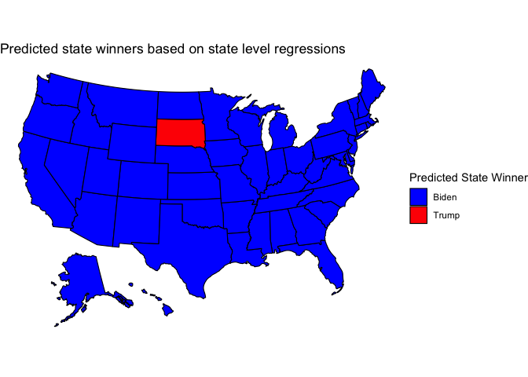

The Role of the Economy in Elections
================
Samuel Thau
9/19/2020

## Introduction

Many election forecasting models rely at least in part on so called
“fundamentals,” that are outside of the candidates control. The
classic example of a “fundamental” is the economy. The incumbent
challengers (and theoretically, a candidate from the incumbent party)
could have some influence on the economy, but in general it is well
outside of the control of any one person or campaign. For example, some
believe that the economy was the deciding factor in the 2012 election,
given then President Barack Obama the edge over Mitt Romney, with the
economy growing just enough to overcome the typical anit-incumbent
sentiment in United State elections\[1\].

In doing so, a number of assumptions are made about voters. There are
three main factors to consider when attempting to model voter choice as
a function of the economy:

1)  How direct is the relationship between voting and the economy?
2)  Do voters have complete information?
3)  Do voters have a sociotropic or individual focus?

Questions 2 and 3 have been studied empirically, and will inform the
model that I build during this post. The answer to question 1 is more
philosophical: does seeing higher GDP numbers make voters more inclined
to vote one way or another? Or is it more indirect, where a higher GDP
leads to more money in people’s pockets, making them happier which makes
them more inclined to vote for the status quo? Figuring out the answer
is tricky.

## Choosing Model Inputs

To model voter behavior, we must first think about the inputs into a
model. Let’s begin with the issue of time frame. It is a well documented
fact that people have short memories when it comes to abstract ideas
like the economy, and that remains true when looking at voting outcomes.
Not only are people much more responsive to the election year
economy\[2\], placing nearly 75% of the weight on the election year
economy, they place the majority of their weight on the final two
quarters before the election\[3\]. Because of this, I will use data from
the second quarter of 2020 (as third quarter data does not yet exist).

To deal with the problem of figuring out which variables to choose,
consider both questions 1 and 3 from the introduction. I believe that it
is a reasonable assumption that people care about their own income, but
also are influenced by the national economy (either indirectly through
the job market, or just through the news). Because of this, I will use
two economic indicators: national level GDP growth in quarters 1 and 2
of the election year, and personal income growth in quarters 1 and 2. In
both cases, the data I use is compared to the previous quarter and
controls for the time of year. I will vary the scope (e.g. national vs
state) of the personal income data, depending on the exact model.

Varying the scope of personal income is intentional: I believe it is a
reasonable assumption to make that for more direct economic indicators,
people may be influenced a more local level. After examining the
results, we will return to if this is actually a reasonable assumption
to make.

## A National Model

We can begin with a national level model, looking at data over time. We
can regress national personal income growth in the first and second
quarters, along with national GDP growth on the incumbents two party
vote share in each election year.

    ##        1 
    ## 28.68767

    ## 
    ## Call:
    ## lm(formula = vote_margin ~ 1 + GDP_growth_qt_1 + GDP_growth_qt_2 + 
    ##     RDI_growth_1 + RDI_growth_2, data = nat_econ_df)
    ## 
    ## Residuals:
    ##    Min     1Q Median     3Q    Max 
    ## -6.478 -2.683  1.478  2.616  5.366 
    ## 
    ## Coefficients:
    ##                 Estimate Std. Error t value Pr(>|t|)    
    ## (Intercept)       48.343      2.621  18.447 4.72e-09 ***
    ## GDP_growth_qt_1    2.254      1.467   1.536    0.156    
    ## GDP_growth_qt_2    2.149      1.426   1.507    0.163    
    ## RDI_growth_1      -1.675      2.149  -0.779    0.454    
    ## RDI_growth_2       1.416      1.928   0.735    0.479    
    ## ---
    ## Signif. codes:  0 '***' 0.001 '**' 0.01 '*' 0.05 '.' 0.1 ' ' 1
    ## 
    ## Residual standard error: 4.388 on 10 degrees of freedom
    ## Multiple R-squared:  0.5003, Adjusted R-squared:  0.3004 
    ## F-statistic: 2.503 on 4 and 10 DF,  p-value: 0.1091

This model does an all together mediocre job of prediction.

  - It has an R^2 value of `0.50`, which means that the model explains
    almost exactly half of the variance in the dataset.

  - There is a negative coefficient on the first quarter personal income
    of `-1.675`, while there is a positive coefficient on the second
    quarter personal income of `1.416`. This would suggest that voters
    really have a “what have you done for me lately” attitude. This
    means that for an increase of one percent personal income growth in
    the first quarter, holding all else constant, the vote share for the
    incumbent party is expected to decrease.

  - In general, the standard errors for the coefficients are quite high,
    relative to the magnitude of the coefficients, suggesting that these
    results cannot be taken particuarly seriously. However, this may
    just be a problem with sample size.

All together, this model seems like it could be useful, but we must
first map it onto the state level. Something to check is if the
predicted outcomes makes sense. This model predicts that Trump will win
`28.69` percent, an exceedingly low fraction of the popular vote. This
is likely tied to the severe decline in GDP in the second quarter due to
COVID.

## A State Level Model

As discussed in last week’s post, the states are what really matters for
winning elections. We can move to a state by state model, first
estimating the results for each state indepedently. To do so, we draw on
personal income data from the first and second quarters of each election
year dating back to 1960\[4\]. Unfortunately, the state by state data
for quarter 2 will not be released until later this week, so for the
time being I used the national personal income growth for quarter 2 in
every state. We run 50 indepdent regressions, one for each state and
estimate the results of this year’s election by doing so.

<!-- -->

This election map is somewhat surprsing: again, it would appear that a
massive GDP drop off in the second quarter dooms President Trump. This
would be one of the worst results in history of the United States. We
can look at the vote margins for Trump in a few states:

| State       | Trump Vote Share | Vote Margin | Winner |
| :---------- | ---------------: | ----------: | :----- |
| Alabama     |        26.403849 |  \-47.19230 | Biden  |
| Alaska      |        42.090632 |  \-15.81874 | Biden  |
| Arizona     |         5.013441 |  \-89.97312 | Biden  |
| Arkansas    |        18.532859 |  \-62.93428 | Biden  |
| California  |        28.805607 |  \-42.38879 | Biden  |
| Colorado    |        17.237667 |  \-65.52467 | Biden  |
| Connecticut |        21.051791 |  \-57.89642 | Biden  |
| Delaware    |        19.302765 |  \-61.39447 | Biden  |

Based on this model, Trump is not only consistently losing, but
consistently getting routed. One potential problem with this model is
that each state is independent: it could be that in years where the
economy is in bad shape, certain states respond in similar ways across
time.

## Incorporating State Fixed Effects

Instead of running 50 seperate regressions, we can instead run a single,
much larger regression but with dummy variables for the states. This
controls for particular states behaving similarly across time\[5\].

<style type="text/css">
.scroll-100 {
  max-height: 350px;
  overflow-y: auto;
  background-color: inherit;
}
</style>

``` scroll-100
## 
## Call:
## lm(formula = vote_share ~ Q1 + Q2 + gdp_1 + gdp_2 + state, data = state_reg)
## 
## Residuals:
##     Min      1Q  Median      3Q     Max 
## -43.325  -6.317   0.219   6.497  49.152 
## 
## Coefficients:
##                           Estimate Std. Error t value Pr(>|t|)    
## (Intercept)               47.64501    2.92181  16.307  < 2e-16 ***
## Q1                         0.14035    0.06158   2.279   0.0229 *  
## Q2                        -0.09386    0.05943  -1.579   0.1147    
## gdp_1                      2.07015    0.49006   4.224 2.71e-05 ***
## gdp_2                      2.57721    0.38422   6.708 4.05e-11 ***
## stateAlaska                0.35305    3.97471   0.089   0.9292    
## stateArizona              -0.23693    3.97564  -0.060   0.9525    
## stateArkansas             -1.53453    3.97404  -0.386   0.6995    
## stateCalifornia           -0.36613    3.97611  -0.092   0.9267    
## stateColorado             -0.24455    3.97579  -0.062   0.9510    
## stateConnecticut           1.10445    3.97457   0.278   0.7812    
## stateDelaware              0.24263    3.97565   0.061   0.9514    
## stateDistrict of Columbia -1.41817    4.04246  -0.351   0.7258    
## stateFlorida               0.40891    3.97685   0.103   0.9181    
## stateGeorgia              -1.39878    3.97452  -0.352   0.7250    
## stateHawaii                2.98462    3.97598   0.751   0.4531    
## stateIdaho                -1.50155    3.97445  -0.378   0.7057    
## stateIllinois             -0.44256    3.97451  -0.111   0.9114    
## stateIndiana              -0.66008    3.97450  -0.166   0.8681    
## stateIowa                 -1.50825    3.97491  -0.379   0.7045    
## stateKansas               -1.15899    3.97510  -0.292   0.7707    
## stateKentucky             -0.85581    3.97477  -0.215   0.8296    
## stateLouisiana            -1.39417    3.97428  -0.351   0.7258    
## stateMaine                 2.08528    3.97431   0.525   0.6000    
## stateMaryland              0.50613    3.97563   0.127   0.8987    
## stateMassachusetts         0.24969    3.97437   0.063   0.9499    
## stateMichigan              0.49366    3.97410   0.124   0.9012    
## stateMinnesota            -1.34342    3.97588  -0.338   0.7355    
## stateMississippi          -1.48956    3.97494  -0.375   0.7080    
## stateMissouri             -1.15179    3.97413  -0.290   0.7720    
## stateMontana              -2.12416    3.97598  -0.534   0.5933    
## stateNebraska             -0.45873    3.97422  -0.115   0.9081    
## stateNevada               -1.01995    3.98179  -0.256   0.7979    
## stateNew Hampshire         1.04226    3.97466   0.262   0.7932    
## stateNew Jersey            1.64157    3.97466   0.413   0.6797    
## stateNew Mexico           -0.83239    3.97407  -0.209   0.8342    
## stateNew York              0.87950    3.97435   0.221   0.8249    
## stateNorth Carolina       -0.65306    3.97477  -0.164   0.8695    
## stateNorth Dakota         -2.72779    3.98947  -0.684   0.4944    
## stateOhio                 -0.13395    3.97468  -0.034   0.9731    
## stateOklahoma             -0.40766    3.97544  -0.103   0.9184    
## stateOregon               -1.40166    3.97756  -0.352   0.7247    
## statePennsylvania         -0.74369    3.97715  -0.187   0.8517    
## stateRhode Island          1.39328    3.97444   0.351   0.7260    
## stateSouth Carolina       -1.37423    3.97595  -0.346   0.7297    
## stateSouth Dakota         -1.88598    4.00152  -0.471   0.6376    
## stateTennessee            -1.25400    3.97622  -0.315   0.7526    
## stateTexas                -0.11298    3.97593  -0.028   0.9773    
## stateUtah                 -0.16320    3.97423  -0.041   0.9673    
## stateVermont               1.57425    3.97492   0.396   0.6922    
## stateVirginia              0.14062    3.97537   0.035   0.9718    
## stateWashington            0.28444    3.97969   0.071   0.9430    
## stateWest Virginia        -1.84890    3.97510  -0.465   0.6420    
## stateWisconsin            -1.18991    3.97404  -0.299   0.7647    
## stateWyoming              -1.58783    3.97480  -0.399   0.6897    
## ---
## Signif. codes:  0 '***' 0.001 '**' 0.01 '*' 0.05 '.' 0.1 ' ' 1
## 
## Residual standard error: 10.69 on 708 degrees of freedom
## Multiple R-squared:   0.13,  Adjusted R-squared:  0.06364 
## F-statistic: 1.959 on 54 and 708 DF,  p-value: 8.309e-05
```

Taking a careful look at this regression reveals some interesting
trends.

1)  `Q1` and `Q2` are the personal income in the first and second
    quarters before an election year, and based on the coefficients,
    they do not seem to matter for the incumbent’s vote share nearly as
    much as GDP or the state fixed effects.

2)  One way to interpret the state fixed effects is as a measure of
    willingness to vote for an incumbent. With that interpretation in
    mind, it is not surprising that many of the coefficients are
    negative, given the well documented bias against incumbents.

3)  Before making predictions or looking at the electoral map, again
    this would seem to tilt heavily in Biden’s favor for the upcoming
    election, given the severe drop in GDP during the second quarter of
    this year.

We can use this model to generate an electoral map, along with electoral
college results.

``` scroll-100
##                   State Trump Vote Fraction Vote Margin Winner
## 1               Alabama            23.52186   -52.95628  Biden
## 2                Alaska            23.65034   -52.69931  Biden
## 3               Arizona            23.34108   -53.31785  Biden
## 4              Arkansas            21.84697   -56.30605  Biden
## 5            California            23.07152   -53.85696  Biden
## 6              Colorado            23.16503   -53.66994  Biden
## 7           Connecticut            24.55614   -50.88772  Biden
## 8              Delaware            23.79256   -52.41487  Biden
## 9  District of Columbia            22.00545   -55.98911  Biden
## 10              Florida            23.94481   -52.11038  Biden
## 11              Georgia            22.15116   -55.69769  Biden
## 12               Hawaii            26.08542   -47.82916  Biden
## 13                Idaho            22.16066   -55.67867  Biden
## 14             Illinois            23.00912   -53.98175  Biden
## 15              Indiana            22.62317   -54.75365  Biden
## 16                 Iowa            22.08379   -55.83243  Biden
## 17               Kansas            22.22251   -55.55497  Biden
## 18             Kentucky            22.56780   -54.86440  Biden
## 19            Louisiana            22.02945   -55.94111  Biden
## 20                Maine            25.63521   -48.72957  Biden
## 21             Maryland            23.92974   -52.14052  Biden
## 22        Massachusetts            23.70137   -52.59726  Biden
## 23             Michigan            23.56638   -52.86723  Biden
## 24            Minnesota            22.13634   -55.72733  Biden
## 25          Mississippi            21.93405   -56.13189  Biden
## 26             Missouri            22.25779   -55.48443  Biden
## 27              Montana            21.20121   -57.59758  Biden
## 28             Nebraska            23.06314   -53.87373  Biden
## 29               Nevada            22.23524   -55.52953  Biden
## 30        New Hampshire            24.39570   -51.20860  Biden
## 31           New Jersey            25.00904   -49.98191  Biden
## 32           New Mexico            22.97018   -54.05964  Biden
## 33             New York            24.09259   -51.81483  Biden
## 34       North Carolina            22.88283   -54.23433  Biden
## 35         North Dakota            20.72390   -58.55221  Biden
## 36                 Ohio            23.23352   -53.53295  Biden
## 37             Oklahoma            23.04403   -53.91194  Biden
## 38               Oregon            21.99389   -56.01223  Biden
## 39         Pennsylvania            22.62378   -54.75243  Biden
## 40         Rhode Island            24.85900   -50.28199  Biden
## 41       South Carolina            22.18974   -55.62053  Biden
## 42         South Dakota            21.50957   -56.98087  Biden
## 43            Tennessee            22.14155   -55.71691  Biden
## 44                Texas            23.50713   -52.98574  Biden
## 45                 Utah            23.48498   -53.03004  Biden
## 46              Vermont            25.06804   -49.86391  Biden
## 47             Virginia            23.74669   -52.50661  Biden
## 48           Washington            23.76420   -52.47161  Biden
## 49        West Virginia            21.57472   -56.85057  Biden
## 50            Wisconsin            22.27581   -55.44838  Biden
## 51              Wyoming            21.91999   -56.16002  Biden
```

Biden wins quite literally every single state, in what would be the most
lopsided election in United States history.

1.  Sides, John, et al. The Gamble: Choice and Chance in the 2012
    Presidential Election - Updated Edition. Princeton University Press,
    2014. Project MUSE muse.jhu.edu/book/64467.

2.  Healy, Andrew, and Lenz, Gabriel S. “Substituting the End for the
    Whole: Why Voters Respond Primarily to the Election-Year Economy.”
    American Journal of Political Science, vol. 58, no. 1, 2014,
    pp. 31–47.

3.  Achen, Christopher H, and Bartels, Larry M. Democracy for Realists.
    REV - Revised ed., Princeton University Press, 2017.

4.  This data comes from the U.S. Bureau of Economic Analysis,
    [“Quarterly Personal Income By
    State.”](https://apps.bea.gov/itable/iTable.cfm?ReqID=70&step=1)

5.  A careful examination of the code reveals that I am not conducting a
    fixed effects regression in the standard way. To get consistent and
    unbiased estimates for the coefficients, I would normally subtract
    the mean value across time for each state. However, with this
    dataset, doing so leads to problems with collinearity (as GDP and
    personal income are correlated) when trying to make predictions. For
    the sake of having predictions, I decided to just include dummy
    variables instead.
