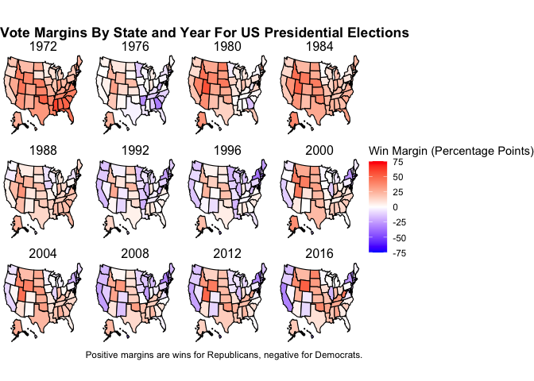
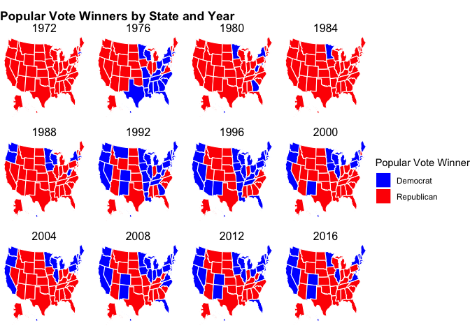

Introduction: Welcome to the Blog
================
Samuel Thau
9/9/2020

## Introduction

Before we get into prediction, it will be helpful to get some background
on the history of electionis in the United States. Let’s start with a
relatively simple question: how do election results change year to year?
There are several ways to measure the results of an election:

1.  Popular vote share - this is what most people think of as the
    “popular vote.”
2.  Two party popular vote share - this exculdes third party candidates.
    This excludes third party candidates, which rarely have an impact on
    the election (though in close elections, or in select cases, this
    can be quite different from the popular vote share)
3.  Electoral votes - awarded on a state by state basis, this is what
    candidates have to win to win the presidency. Predicting the
    electoral college, instead of the popular vote share, is more
    somewhat more complex because it happens at the state by state
    level.

## Vote Share

Because the presidential election is determined on a state by state
basis, it’s good to start looking at some maps. For now, I’ll stick to
the two party vote share, becuase intuitively that’s what matters for
election outcomes; because of the weakness of third party campaigns
since WWII (though there are some exceptions), whoever wins between the
Republican and Democrat almost always wins the state.

<!-- -->

Looking at the vote shares over time can be deceptive: in every state
but Nebraska and Maine, states operate on a winner take all basis, so
this last graphic does not tell the full story. For example, in 1972,
**Richard Nixon** beat **George McGovern** by `59.9` percentage points
in Mississippi, meaning that if **185k people** switched their votes
from Nixon to McGovern, Nixon *still* would have won Mississippi.
Looking at who actually won the states may paint a clearer picture of
electoral trends over time.

<!-- -->

There are a lot of different conclusions that can be drawn from the
winner take all graphic, many of which I’m excited to explore as the
class continues. For example, certain states have remained remarkably
consistent in which party they vote for: Texas has not voted for a
Democrat since `1976`, and Minnesota has not voted for a Republican since
`1972`. 

This phenomenon may be the result of many possible outcomes:
political polarization, relatively low migration combinded with
demographic preferences, economic trends (based on industry), and many
other possibilities. It is difficult to determine which (if any) of
these factors play a major role, so further investigation over the
course of the semester is neccessary.

## Tipping Point States

The combination of the electoral college and looking at the vote share
over time begs a question: which states matter to decide elections? To
do this, I’ll use the idea of a tipping point state.

A **tipping point state** is a state that puts a candidate over the 270
electoral vote threshold. To figure out which state this is, we order
the states by net vote share. For example, in 2016 <insert state here>
voted for overwhelmingly for Trump with <percent of the vote>, so that
would be the first state in the list. We then order the rest of the
states by the margin they voted for or against Trump, and keep track of
the electoral college votes. One thing to keep in mind is that the
electoral college values for different states has changed over time.

All of this disucssion leads to a natural question: what are the most
common tipping point states? We can produce a list of the tipping point
state in every election going back to WWII. I matched the electoral
college values that I got from
[archive.gov](https://www.archives.gov/electoral-college/results) and
[Wikipedia](https://en.wikipedia.org/wiki/United_States_Electoral_College)
for each state with the two party vote shares from Lab 1. Using the two
party vote shares leads to three issues: in 1948 and 1964 in Alabama,
Harry Truman and Lyndon B. Johnson were not included on the ballot
meaning the two party vote shares from that year are missing, and the
electoral votes were not pledged. Second, it does not account for third
party candidates winning electoral votes. The only times this has
happened since WWII was Strom Thurmond in 1948 and George Wallace in the
1968 election. For both of these issues, I simply removed those states
from the calculation. Third, and most importantly, the margin of victory
in the two party vote share may be different from the overall margin of
victory when accounting for other candidates.

In addition, this calculation does not account for states that split
electoral votes, like Maine and Nebraska currently do. It also does not
account for faithless electors. This calculation *does* account for
changing electoral college values over time.

        Tipping Point State Election
     1             Illinois     1948
     2             Michigan     1952
     3            Louisiana     1956
     4           New Jersey     1960
     5           Washington     1964
     6                 Ohio     1968
     7                 Ohio     1972
     8            Wisconsin     1976
     9             Illinois     1980
     10            Michigan     1984
     11            Michigan     1988
     12            Colorado     1992
     13        Pennsylvania     1996
     14             Florida     2000
     15                Ohio     2004
     16            Colorado     2008
     17        Pennsylvania     2012
     18        Pennsylvania     2016
